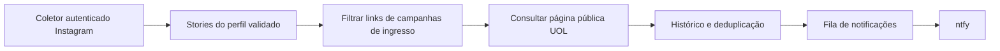

# Stories do Clube UOL: estudo para coleta automática em servidor

Verificação: 09/10/2026. Horários abaixo em America/Sao_Paulo.

**Resultado:** a sessão dedicada conseguiu ler os Stories e os destinos dos stickers. A página autenticada entrega os dados estruturados, inclusive pela entrada genérica `/stories/clubeuol/`, sem precisar conhecer o próximo ID. Isso comprova a extração no navegador local. HTTP direto, estabilidade da sessão e operação contínua no servidor ainda não foram validados. Nenhum monitor de Instagram foi ativado.

O objetivo é um processo de servidor, com detecção em poucos minutos e sem participação do Codex ou do Mac em cada consulta. Acompanhamento manual e heartbeat local não atendem a esse objetivo.

## Evidência observada

| Story | Publicação | Expiração do Story | Destino do sticker | Classificação |
| --- | --- | --- | --- | --- |
| `4004185955500703427` | 09/10/2026 11:29:43 | 10/10/2026 11:29:43 | `campanhasdeingresso/pPM-2-ingressos-bgs-distrito-anhembi-sp` | Campanha de ingressos BGS |
| `4004282829240101142` | 09/10/2026 14:42:10 | 10/10/2026 14:42:10 | `fotoregistro/pO8-ms-das-crianas-1-quebra-cabea-grtis` | Outro benefício; fora do alerta de ingressos |

O sticker da BGS foi verificado tanto no diálogo visual quanto no objeto estruturado do mesmo Story. URL limpa: <https://clube.uol.com.br/campanhasdeingresso/pPM-2-ingressos-bgs-distrito-anhembi-sp>.

A coleta UOL feita antes deste estudo já havia encontrado `pPM` fora dos quatro catálogos monitorados. A página informava validade de **07/10/2026 17:13 a 09/10/2026 17:30**. O Story foi publicado cerca de seis horas antes do fim do benefício e expiraria só no dia seguinte. Portanto, Story ainda disponível não significa benefício vigente; a validade também não informa quando a campanha foi cadastrada. Estoque continuou não confirmado.

Provas locais sanitizadas, sem cookies, senha, tokens ou HTML bruto:

- `~/.local/share/uol-ticket-research/proofs/instagram-bgs.json`: leitura do sticker com verificação do ID antes/depois.
- `~/.local/share/uol-ticket-research/proofs/instagram-bgs.png`: prova visual.
- `~/.local/share/uol-ticket-research/proofs/instagram-structured.json`: dois Stories da resposta da página específica.
- `~/.local/share/uol-ticket-research/proofs/instagram-generic-entry-confirmed.json`: mesmos dois Stories pela entrada genérica, observados às 16:18:28, sem clicar em cada publicação.
- `instagram-generic-entry.json` preserva uma primeira extração vazia/inconclusiva. Uma leitura vazia ou com estrutura diferente não pode ser classificada como “nenhum Story”.

## Como o site entrega os links

1. Entrar uma vez na conta dedicada. Nesta sessão, o Instagram exigiu CAPTCHA, concluído pelo usuário. Não houve comprovação de login autônomo em servidor.
2. Abrir <https://www.instagram.com/stories/clubeuol/>. Esse caminho foi observado ao clicar na foto do perfil e depois validado por navegação direta.
3. Ler o corpo da resposta HTML autenticada. Nos blocos `script[type="application/json"]`, localizar a estrutura de Stories do perfil. Não executar esses scripts.
4. O payload observado contém `data.xdt_api__v1__feed__reels_media.reels_media`. Os wrappers `__bbox` e `require` são detalhes internos e podem mudar. O parser deve reconhecer uma estrutura validada, não fixar índices de arrays.
5. Selecionar exclusivamente o reel cujo `user.username` é `clubeuol`. Dentro de `items`, cada Story contém `pk`, `taken_at`, `expiring_at` e `story_link_stickers[].story_link.url`. Manter IDs como strings: excedem a precisão inteira segura de JavaScript.
6. O link visual passa por `l.instagram.com`; o campo estruturado permite obter o destino. Normalizar e validar a URL antes de qualquer consulta UOL. Remover somente parâmetros conhecidos de rastreamento em rotas públicas reconhecidas; destinos desconhecidos ficam para revisão.

Isso é uma estrutura interna do site autenticado, **não uma API pública com contrato ou quota documentados**. Não foi comprovado neste estudo que uma API oficial permita consultar Stories de terceiros com essa conta. Não depender de IDs de operações GraphQL inventados, enumeração de IDs do Instagram ou serviços de contorno de CAPTCHA.

O caminho visual também funciona: `Ver story` → `Pausar` → sticker → `Acessar link`. É mais frágil: no painel estreito, o controle de pausa não apareceu e houve avanço para o Story seguinte. Na janela ampla, a pausa funcionou. Preferir os objetos estruturados para associar ID, horário e link; não extrair um link do DOM e atribuí-lo ao ID anterior sem verificar a renderização.

## Fluxo de servidor proposto

- **Coletor:** serviço independente, sessão persistente e conta dedicada. Primeiro validar GET autenticado da página genérica a partir do servidor, sem navegador por rodada. Se isso não funcionar, testar um navegador persistente com recursos medidos. Não assumir que os cookies locais funcionarão em outro IP.
- **Classificação:** hostname exato `clube.uol.com.br`, HTTPS e rota pública `/campanhasdeingresso/<codigo>-<slug>`. Case dos códigos preservado. Sorteios, descontos, outros benefícios e URLs sem destino verificável não viram alertas de resgate.
- **Verificação UOL:** GET da oferta concreta, identidade/canonical, título, descrição, validade e estado público. Nenhum endpoint de resgate, login UOL ou botão “Utilizar este benefício”. Página presente não prova estoque.
- **Histórico:** guardar perfil, Story ID, publicação, expiração, primeira/última observação, URL canônica, código, validade UOL, última evidência de listagem e classificação. Preservar `first_seen_public`, `first_listed` e `instagram_published_at` separadamente. A listagem diária pode estar defasada; exibir sua data, sem afirmar “não listado agora”.
- **Deduplicação:** chave de coleta `(perfil, story_id, URL canônica)`; chave de alerta por campanha e mudança relevante. Um Story republicado não gera automaticamente outro alerta da mesma oferta. Uma URL alterada em Story já conhecido precisa gerar atualização.
- **Entrega:** outbox persistente com confirmação HTTP/recibo, deduplicação e retentativas independentes da coleta. Falha no ntfy não repete consultas nem resgates. Futuro destino pretendido: o tópico ntfy já usado no projeto; nenhuma mensagem foi enviada neste estudo.
- **Resgate:** integração futura e separada. A sentinela continua pausada. Descobrir uma oferta no Instagram não autoriza resgatá-la nem reduz as travas mensais ou a exigência de artista/data/local confirmados no conteúdo UOL.

## Frequência, limites e falhas

Proposta inicial para teste de capacidade: uma coleta a cada **120 segundos**, com variação pequena e uma única coleta em andamento. São até 720 ciclos/dia; isso não equivale a 720 requisições se um navegador carregar scripts, mídia e serviços auxiliares. Medir o tráfego real. Não há quota segura do Instagram comprovada para esse transporte e essa conta; não copiar os limites conhecidos do Clube UOL.

Meta de latência, ainda não medida: alerta em até três minutos após a publicação durante operação saudável. O tempo inclui a próxima coleta, disponibilidade do Story para a conta, leitura UOL e entrega. Só reduzir para 60 segundos após evidência de estabilidade e consumo aceitável. Polling não garante alcançar o estoque antes de outras pessoas.

| Condição | Comportamento esperado |
| --- | --- |
| Mesmos IDs e links | Atualizar observação, sem novo alerta |
| Lista vazia com estrutura válida e evidência explícita | Registrar ausência de Stories nesse instante |
| HTTP 200 com login, HTML incompleto ou formato desconhecido | Estado inconclusivo; preservar histórico |
| Timeout/5xx | Backoff limitado; sem consultas sobrepostas |
| 429 | Respeitar `Retry-After`, suspender ciclos; sem troca de contas ou IPs para contorno |
| 401/403, CAPTCHA, desafio ou sessão expirada | `auth_required`/bloqueado; parar repetição de login e sinalizar falha uma vez |
| Reinício | Retomar sessão/estado persistidos e fila, sem duplicar alertas |

Uma conta dedicada reduz o impacto sobre a conta principal, mas não elimina desafios de autenticação. Este login já exigiu intervenção humana. Não é possível prometer ausência definitiva de CAPTCHA ou renovação manual apenas com a prova local. Se a operação exigir intervenção frequente, não atende ao requisito do usuário e não deve ser tratada como solução pronta.

## Reaproveitamento do projeto

Evidência documental local; disponibilidade atual dos servidores não consultada nesta etapa:

- [Saquetto Drops](../saquetto-drops/README.md): Oracle com Node, systemd e SQLite já faz parte do projeto. O teste anterior de Chrome/CDP ficou parado por capacidade. Isso não comprova um navegador persistente saudável nem capacidade livre hoje.
- [Worker de descoberta](../../cloudflare-workers/uol-telegram-shadow-worker/README.md): reutilizar o formato de oferta, deduplicação e fila existentes; ingresso descoberto por sticker pode ser outra origem. Não abrir um segundo caminho de envio que duplique os alertas.
- [Sentinela](../../cloudflare-workers/uol-redemption-sentinel/README.md): aproveitar o padrão de outbox/ntfy e isolamento das notificações, mantendo a capacidade de resgate desabilitada neste coletor.
- [Pesquisa diária](README.md): histórico de códigos, validade e listagem complementa o Instagram. A rotina de 18h criada na etapa anterior é local ao Codex e depende do Mac; não atende ao requisito de coleta rápida em servidor. Uma futura implantação deve levar esse trabalho diário ao runtime do servidor e evitar duas varreduras concorrentes.

Não criar novo serviço Cloudflare, cron ou dependência de navegador até comprovar o transporte e conferir capacidade/limites reais do ambiente escolhido.

## Critérios para uma futura implementação ser aceita

1. Reproduzir no servidor a lista atual e os destinos, partindo apenas de `clubeuol`, sem ID previamente informado e sem abrir o Codex.
2. Distinguir perfil errado, login/desafio, payload incompleto e ausência real de Stories; mudança de formato deve falhar sem alertar ofertas erradas.
3. Confirmar um Story novo real durante o teste. Os dois Stories atuais provam extração, não detecção futura.
4. Testar por pelo menos 72 horas, incluindo reinício, deduplicação, falha de rede e retomada de sessão. Medir CPU/memória/tráfego, falhas e atraso real. Sessenta ou cento e vinte segundos são propostas, não intervalos validados.
5. Validar outbox com falha de entrega simulada e, quando autorizado, entrega real ao destino. Não enviar alertas de teste para grupos por padrão.
6. Nenhum resgate, credencial em log/repositório, sessão exportada em artefatos, OCR ou alteração na sentinela pausada.

**Estado final deste estudo:** extração estruturada e descoberta pela entrada genérica comprovadas no navegador autenticado; monitor em servidor, transporte HTTP direto e autonomia prolongada pendentes. O próximo trabalho é uma prova limitada de transporte/capacidade no servidor, antes de implementar ou ativar acompanhamento contínuo.
